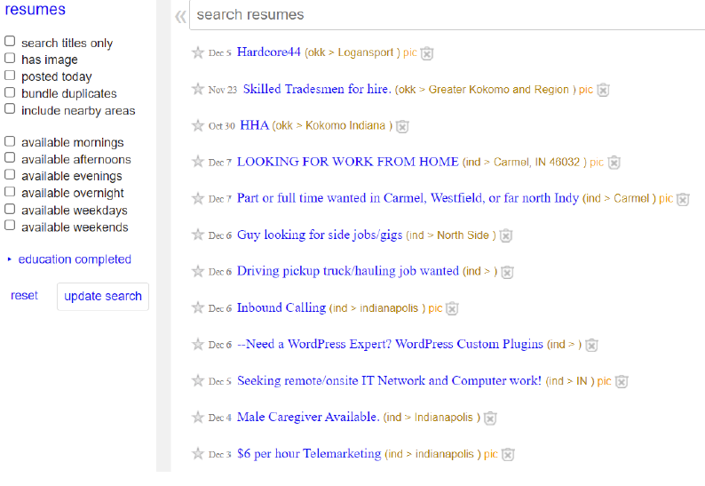
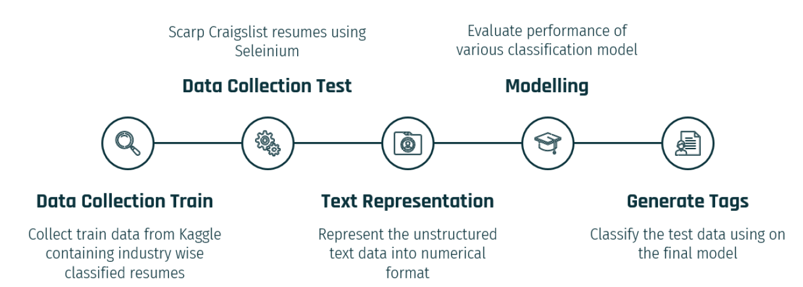
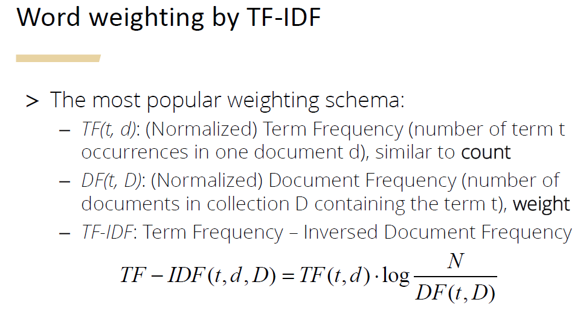
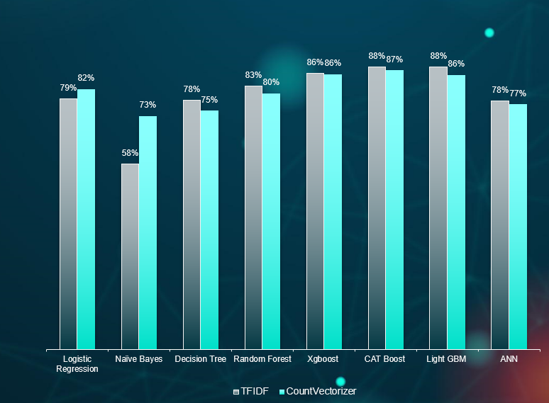
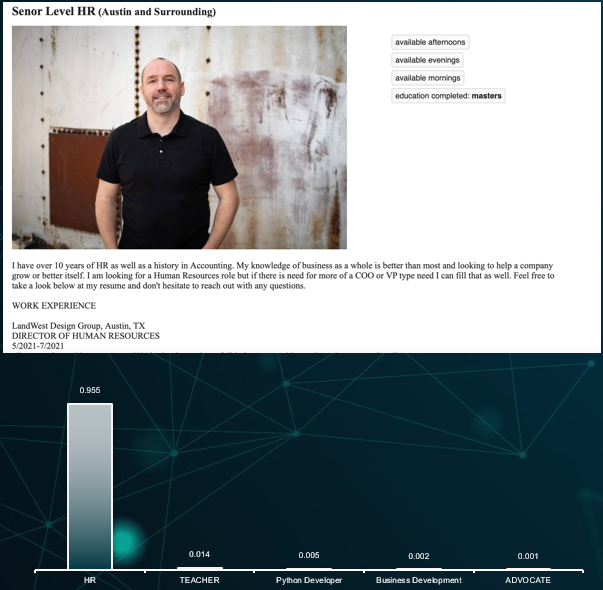
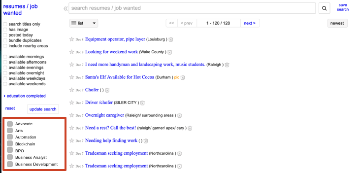

# Resume Classification

This repository contains all the files of the HR Analytics project in Purdue

# Table of Contents
- [Overview](#overview)
- [Methodology](#methodology)
  - [1. Data Collection](#1-data-collection)
  - [2. Data Pre Processing](#2-data-pre-processing)
    - [Data Normalisation](#data-normalisation)
    - [Word Embedding](#word-embedding)
  - [3. Modeling](#3-modeling)
    - [Train & Validation Split](#train-and-validation-split)
    - [Train Multiple Models](#train-multiple-models)
    - [Model Selection](#model-selection)
  - [4. Applying model on Craiglist Resumes](#4-applying-model-on-real-Craiglist-resumes)
- [Business Outcome](#business-outcome)
  
## Overview
Our client is craigslist, we are interested in improving ‘Resumes’ sub-section of the website.The reason we chose this is because, we believe that enhancing and solving some of the problems associated with this section could give competitive advantage to our client.As for the problem statement, we saw that the interface where the resumes are present is highly unstructured. When one opens the section, it is obvious that there is a lot of scope for improvement, as it is way behind craigslist competitors. As seen in the below picture, it’s very hard to understand which resume belongs to what industry.

It is harder for recruiters to find what they are looking for and we know that the recruiters don’t prefer to spend much time on any website, this will make the engagement loss on both ends, from recruiters’ side and candidate’s side. There is a high probability that the churn rate can be increased because of these factors.
When one looks at Indeed, LinkedIn and Facebook marketplace, to survive in the market, it’s important to have a competitive edge.

## Methodology
Now that we have understood what the problem statement is, let us follow a methodology to solve this. We will follow the below steps

### 1. Data Collection
The objective is to model the natural language and tag the corresponding resumes into different categories
- To categorize the resumes, the data required for training the model is collected from two different data sources in Kaggle
- The Data has 2317 labelled resumes and a total of 37 classes in the target variable, which was scraped using a tool called ‘ParseHub’
- Those 37 variables include most from the white-collar jobs than the blue-collar jobs
- The data required for testing the model is scraped from Craigslist
- 70/30 Train/Validation Split

### 2. Data Pre Processing
The Data analysis is the most important step for the natural language processing models. The following steps are carried out to convert the text into numerical representation/ vector representation
##### Data Normalisation
- Tokenization (nltk.word_tokenize())
  - Tokenize the string and convert each word into tokens
  -  With this, each document is represented by a list of tokens
- Removing URL
  -  URLs are to be removed as most of the resumes contain a link to their LinkedIn profile
- Hashtag mentions
  - There could be lot of hashtags which we removed using regular expression
- Extra White spaces
  - Extra whitespaces have also been removed
- Stop words removal
- Lemmatization  (nltk.stem.WordNetLemmatizer())

#### Word Embedding
2 different word embedding techniques were used before modelleling as shown -
-Tf-Idf 
- Count Vectorizer

The logic of Tf-Idf vecorisation is shown as below 

### 3. Modeling
We have `cleaned` and embedded the resumes using both the techniques shown above 
#### Train and Validation Split
The training data will be `randomly` split into `70:30` ratio into `training` and `validation` datasets. We now use the first one to train our model, and the validation data to validate our model's accuracy.
#### Train Multiple Models
I have explored `eight` different techniques to train the model. Click on the links for literature review.
- [Logistic Regression](https://www.analyticsvidhya.com/blog/2021/03/logistic-regression/)
- [Random Forest](https://www.analyticsvidhya.com/blog/2021/03/introduction-to-random-forest-and-its-hyper-parameters/)
- [Extreme Gradient Boosting](https://www.analyticsvidhya.com/blog/2017/06/which-algorithm-takes-the-crown-light-gbm-vs-xgboost
- [Naive Bayes](https://www.analyticsvidhya.com/blog/2021/01/a-guide-to-the-naive-bayes-algorithm/)
- [Decision Tree](https://www.analyticsvidhya.com/blog/2016/04/tree-based-algorithms-complete-tutorial-scratch-in-python/)
- [CAT boost](https://www.analyticsvidhya.com/blog/2021/04/how-to-use-catboost-for-mental-fatigue-score-prediction/)
- [Light GBM](https://www.analyticsvidhya.com/blog/2017/06/which-algorithm-takes-the-crown-light-gbm-vs-xgboost/)
- [ANN](https://www.analyticsvidhya.com/blog/2021/05/beginners-guide-to-artificial-neural-network/)

#### Model Selection
The performance of the above models can be judged based on the validation dataset. The results are below, so my best model is XGBoost using Tf-Idf vector as shown 

### 4.Applying model on real Craiglist resumes

The XGBoost model was applied on real resumes as shown below on a sample resume-

## Business Outcome
With the given model the following tasks can be done

-Resume Based filer on the landing page as shown below :-

-Boost recruiter traffic on resume section

