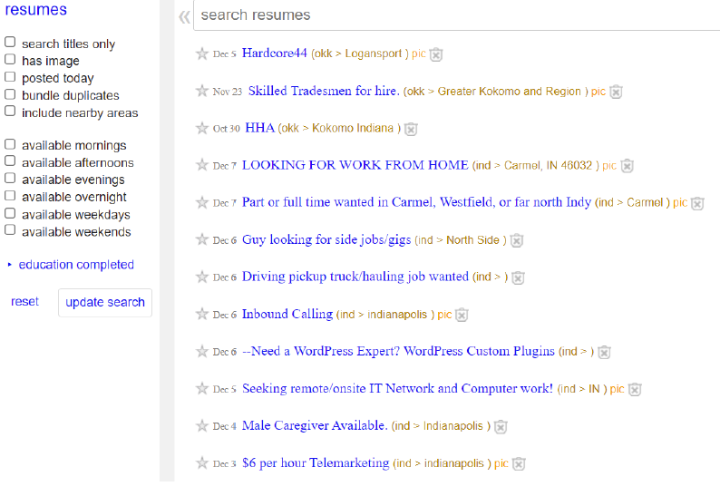

# HR Analytics 

This repository contains all the files of the HR Analytics project in Purdue


# Table of Contents
- [Overview](#overview)
- [Data Dictionary](#data-dictionary)
- [Variable Descriptions](#variable-descriptions)
- [Methodology](#methodology)
  - [1. Data Processing](#1-data-pre-processing)
    - [Feature Elimination](#feature-elimination)
    - [Missing Value Imputation](#missing-value-imputations-mvi)
  - [2. Feature Engineering](#2-feature-engineering)
    - [Name Analysis](#name-analysis)
    - [Group Variables](#group-categories)
    - [Weight of Evidence](#weight-of-evidence)
  - [3. Modeling](#3-modeling)
    - [Train & Validation Split](#train-and-validation-split)
    - [Train Multiple Models](#train-multiple-models)
    - [Model Selection](#model-selection)
  - [4. Scoring](#4scoring)
  
## Overview
Our client is craigslist, we are interested in improving ‘Resumes’ sub-section of the website.The reason we chose this is because, we believe that enhancing and solving some of the problems associated with this section could give competitive advantage to our client.As for the problem statement, we saw that the interface where the resumes are present is highly unstructured. When one opens the section, it is obvious that there is a lot of scope for improvement, as it is way behind craigslist competitors. As seen in the below picture, it’s very hard to understand which resume belongs to what industry.



It is harder for recruiters to find what they are looking for and we know that the recruiters don’t prefer to spend much time on any website, this will make the engagement loss on both ends, from recruiters’ side and candidate’s side. There is a high probability that the churn rate can be increased because of these factors.
When one looks at Indeed, LinkedIn and Facebook marketplace, to survive in the market, it’s important to have a competitive edge.

## Data Dictionary
We have been provided with a ```Train (19158 x 14)``` & ```Test (2129 x 13)``` datasets. The dependant variable is `````"Target"`````

  

## Methodology
Now that we have understood what the problem statement is, let us follow a methodology to solve this. 

### 0. Descriptive Analysis
Let us first look at the class distribution for the number of job seekers in our train data set as shown below-


Furthermore lets looks at the bivariate analysis of the other varaibles with the target variable


Some inferences that we can take from this graph,

-We note that most job-seekers are Male. This is not all that surprising as in this dataset Males make up the majority of the sample population.

-What is more interesting though is the City Development Index (CDI) chart. There we see that there are two peaks for job-seekers. The peaks are at high and low CDI scores.

-We can ponder why this might be. In high CDI areas perhaps there are a lot of opportunities and therefore people feel encouraged to seek better roles.

-Perhaps in lower CDI areas candidates want to improve their circumstances by searching for new jobs, maybe in new areas.

-This is all conjecture, but interesting nonetheless.

-It is also interesting to see that job-seekers have changed job more often that non-job seekers within that past 1 year, and also those that have never looked for a job also seem to be ready for a new challenge.

-However it is only the graduate level people who have more job seekers when compared to other education levels. Some are even seeking a job in their primary school! (Start networking BAIMers)

### 1. Data Pre Processing

#### Target Class Imbalance
We seem from the above EDA that there is a class imbalance and to solve this we used SMOTE as shown below-


#### Missing Value Imputations (MVI)
For treating the missing values we have used K-Nearest Neighbours imputation with a K=6 to impute the categorical and continuous variables.This method seemed more appropriate as compared to mean imputation(for continuous variables) or mode imputation.


### 2. Modeling
We have `cleaned` the data and `derived` some variables so that we can make better predictions. So let us `predict` now. But we need to follow some steps to make a robust model and `avoid over-fitting` the data.

#### Train and Validation Split
The training data will be `randomly` split into `75:25` ratio into `training` and `validation` datasets. We now use the first one to train our model, and the validation data to validate our model's accuracy.
#### Train Multiple Models
I have explored `three` different techniques to train the model. Click on the links for literature review.
- [Logistic Regression](https://www.analyticsvidhya.com/blog/2021/03/logistic-regression/)
- [Random Forest](https://www.analyticsvidhya.com/blog/2021/03/introduction-to-random-forest-and-its-hyper-parameters/)
- [Extreme Gradient Boosting](https://www.analyticsvidhya.com/blog/2017/06/which-algorithm-takes-the-crown-light-gbm-vs-xgboost/)
#### Model Selection
The performance of the above models can be judged based on the validation dataset. The results are below, so my best model is Random Forest.
```python
{
"""
Logit model validation Accuracy: 70.00%
RF model validation Accuracy: 88.1%
XGB model validation Accuracy: 83.8%  
""" 
}
```


### 3.Scoring
We now have a model, trained and validated. Recollect that we have been provided a `test` dataset to make predictions for the `future`. So we perform the same `data-preprocessing` steps on this as well and predict the `Survived` column. But, for this we can `train` our model on the `whole training` dataset and again and use that model so that we have more data to train our model.

We now `submit` the predictions and the `leaderboard score` tells the accuracy we have obtained on the test data. This whole modeling process is an `iterative` one because a `huge number parameters` are involved in the whole lifecycle.

This project has been a great starting point for me. Hopefully it is the same for the readers as well. Thanks!


