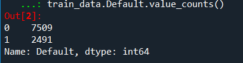
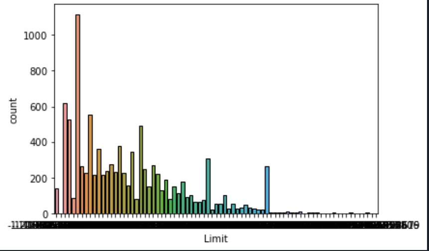
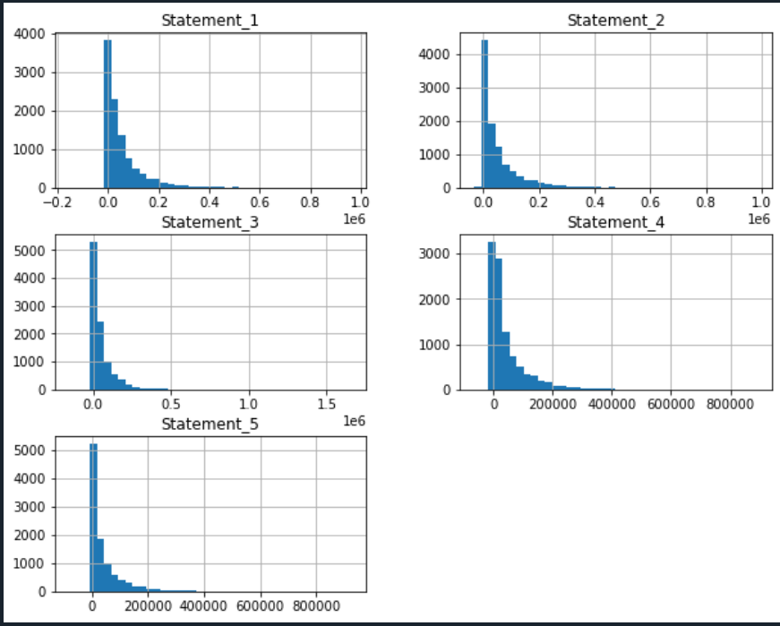
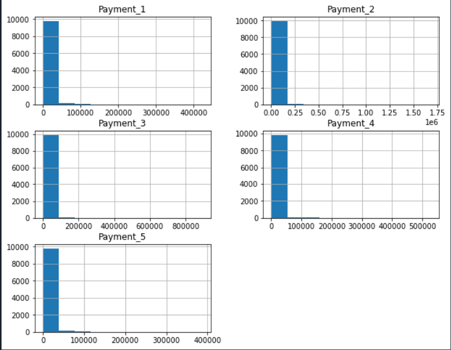
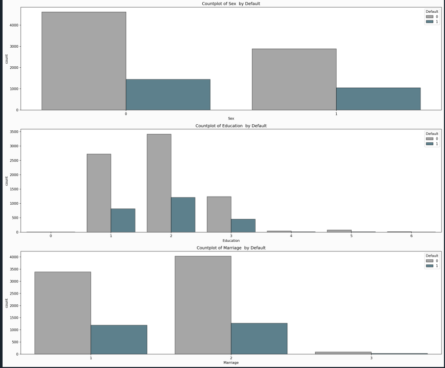
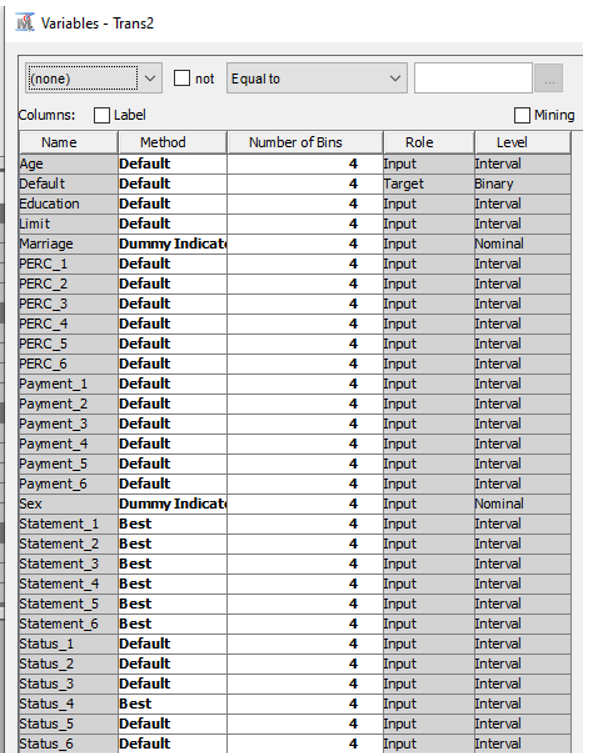
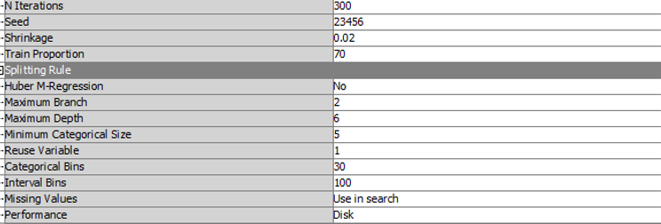
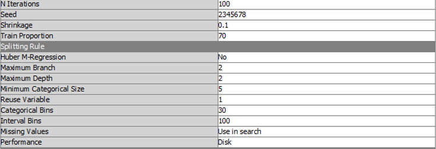
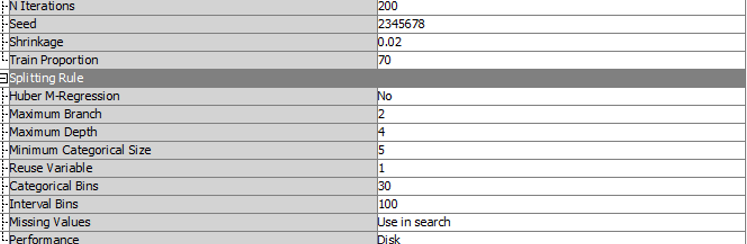
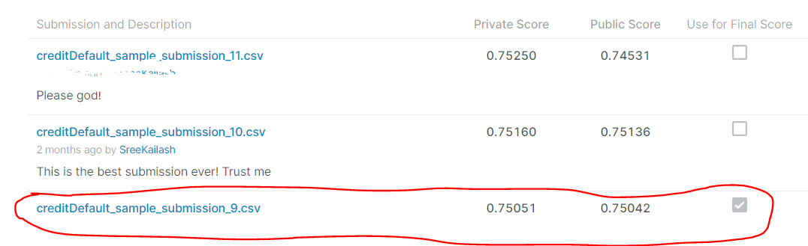

# Risk Modelling In SAS

This repository contains all the files of the Risk Modelling Analytics project in Purdue


# Table of Contents
- [Overview](#overview)
- [Data Dictionary](#data-dictionary)
- [Variable Descriptions](#variable-descriptions)
- [Methodology](#methodology)
  - [1. Descriptive Analysis](#1-descriptive-analysis)
  - [2. Data Pre Processing](#2-data-pre-processing)
    - [Target Class Imbalance](#target-class-imbalance)
    - [Missing Value Imputations](#missing-value-imputations-(mvi))
  - [3. Modeling](#3-modeling)
    - [Train & Validation Split](#train-and-validation-split)
    - [Train Multiple Models](#train-multiple-models)
    - [Model Selection](#model-selection)
  - [4. Scoring](#4scoring)
  
## Overview
Credit Default forecast has been a subject of interest for every credit card company, and the accurate prediction on default can balance the lenders' risk and return. Based on users' historical and demographical information, lenders can modify their policy to the borrowers such as charging a higher rate for higher risks. Overall speaking, the aim of predicting credit default is to develop a predictive model that utilizes historical payment status and certain demographical information to evaluate the likeliness of credit default.

## Data Dictionary
We have been provided with a ```Train (10000 x 24)```  and ```Test (5000 x 23)``` datasets. The dependant variable is `````"Default"`````

  

## Methodology
Now that we have understood what the problem statement is, let us follow a methodology to solve this. 

### 1. Descriptive Analysis
Let us first look at the class distribution for the number of people defaulting.AS one can see approx 25% of the data has default = 1 


Furthermore lets looks at the other variables like the limit vairable which seems to right skewed

Even other variables like Payment and Statement are highly skewed as seen below - 



Now lets do a  bivariate analysis of the other categorical variables wrt to Default



### 2. Data Pre Processing

#### Variable Creation
A new variable was created namely % of statement paid = Payment/Statement

### Data Transformation 
SAS EM's 'best' method was used for transforming the Statement variable with dummy indicators being used for categorical variables as shown-

### 3. Modeling
We have `cleaned` the data and `derived` some variables so that we can make better predictions. So let us `predict` now. But we need to follow some steps to make a robust model and `avoid over-fitting` the data.

#### Train and Validation Split
The training data will be `randomly` split into `80:20` ratio into `training` and `validation` datasets. We now use the first one to train our model, and the validation data to validate our model's accuracy.
#### Train Ensemble Models
we used an ensemble of 3 different gradient boosting algorithms –
- An overfitting Algorithm with the following hyperparameters

-	An underfitting Algorithm with the following hyperparameters

-	A normal Algorithm with the following hyperparameters


The idea of the above logic was to balance out the `bias -variance` tradeoff and to create a robust model that would do decently well on most data sets
#### Model Performance
The overall model looked like this in the SAS EM viewer


The model did well on the private as well as public leaderboard with an AUC of 75% as seen below

### 4.Scoring
We now have a model, trained and validated. Recollect that we have been provided a `test` dataset to make predictions for the `future`. So we perform the same `data-preprocessing` steps on this as well and predict the `Survived` column. But, for this we can `train` our model on the `whole training` dataset and again and use that model so that we have more data to train our model.

We now `submit` the predictions and the `leaderboard score` tells the accuracy we have obtained on the test data. This whole modeling process is an `iterative` one because a `huge number parameters` are involved in the whole lifecycle.


